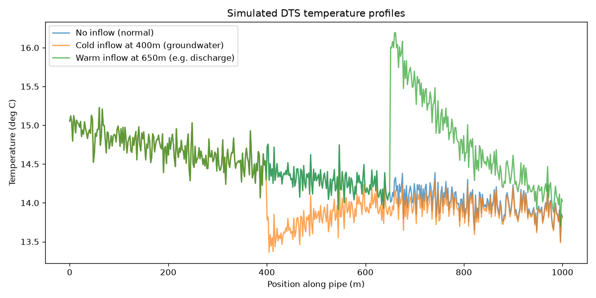

# Distributed Temperature Sensing (DTS) — Inflow Detection and Location



A small research-style project simulating a common water infrastructure
problem: a pipe fitted with a fibre-optic cable that measures temperature
continuously along its length (distributed temperature sensing). Water
entering the pipe at an unexpected point — groundwater infiltration, a
cross-connection, an illicit discharge — carries a different temperature
than the main flow, and shows up as a bump or dip in the temperature
profile. The task is to answer two separate questions from that profile
alone: **is** there an inflow, and if so, **where**?

Nothing here uses real sensor data. Every profile is generated from a
physics-based simulation (`physics.py`), so the project is a controlled
way to compare different detection methods against a known, correct
answer.

This README compares four detection methods and explains why each one
behaves the way it does. The numbers below all come from the same
train/test data (3000 training scenarios, 500 test scenarios, fixed random
seeds), so they are directly comparable to one another.

## Running it

```
pip install -r requirements.txt
python main.py
```

The full run takes a few minutes, mostly training the two neural
networks. Everything else in the project is a plain module of functions
with no executable code of its own — `main.py` is the only file that
actually runs anything. It also saves the plot shown above
(`dts_profiles_preview.png`): a normal profile, a cold inflow at 400 m
and a warm inflow at 650 m.

## Files

| File | What it does |
|---|---|
| `physics.py` | The physics: given an inflow's location, temperature, and rate, computes the resulting temperature profile along the pipe (energy-weighted mixing, then exponential decay back toward ground temperature). |
| `scenarios.py` | Generates many random scenarios (with and without an inflow) by calling `physics.py` repeatedly. Returns the temperature profiles (an array of shape `(n_scenarios, n_points)`), the hidden ground truth for each scenario (a table with `has_inflow`, `position_m`, etc.), and the position in metres of each sensor point. |
| `naive.py` | A simple threshold-based baseline: flag an inflow if the profile deviates from its own smoothed baseline by more than a fixed amount; locate it at the point of largest deviation. Only reports a location when it is confident enough to flag something at all. |
| `ml.py` | A random forest classifier (detection) and regressor (location). |
| `cnn.py` | A 1D convolutional neural network that predicts location as one regressed number. **Did not work well** — kept as a documented negative result. |
| `cnn_softmax.py` | A 1D convolutional neural network that predicts a probability for every position along the pipe. **This is the method that solves the location problem**, and its own probabilities also double as a detection signal, so this single file does both jobs. |
| `evaluate.py` | Scores any method against the ground truth on every scenario in the test set, including the ones with no inflow: detection accuracy, false alarms, missed inflows, and location error. |
| `main.py` | Runs every method above on the same data, scores each with `evaluate.py`, and prints one side-by-side comparison. |

## The methods

### 1. Naive threshold detector — the baseline

Smooth the profile, look at how far the raw signal deviates from that
smoothed version (the *deviation curve*), and flag anything above a fixed
threshold. The location guess is simply the position of the single
largest deviation, reported only when the method is confident enough to
flag something.

Despite being the simplest method by far, this is hard to beat on
location specifically: when a real inflow signal exists,
finding its peak directly is already close to the best possible answer,
because a single, cleanly shaped bump doesn't leave much room for a
cleverer method to improve on it.

### 2. Random forest

A classifier decided whether an inflow was present, using a handful of
summary statistics of the deviation curve (maximum deviation, standard
deviation, etc.). A separate regressor tried to predict *where*, fed the
full 500-point deviation curve, since summary statistics would throw away
exactly the positional detail that location needs.

**Its location estimates are poor — far worse than the naive method.**
Feeding the model the curve position by position is the problem: each
of the 500 input columns corresponds to a *fixed* physical position
(column 340 always means "340 metres along the pipe"), and a tree-based
model has no notion that nearby columns are related. It has to learn a
completely separate rule for every possible position an inflow might
occur at, and with only a few thousand training examples, it cannot do
that reliably. An inflow seen near column 340 in training tells the model
almost nothing about one that occurs at column 120 in a different
scenario.

Position doesn't behave like an ordinary feature, which is what the
convolutional networks below are designed to handle.

### 3. CNN regressor

A 1D convolution slides the *same* learned kernel across every position,
so in principle it should recognise "a bump" wherever it occurs, without
needing to relearn the pattern separately for each position — exactly
the property the random forest was missing.

**It recognises the bump but loses track of where it was.** The
convolutional layer does successfully find the bump pattern, but the
model's final layers (`Flatten()` followed by `Dense` layers) destroy the
direct link between
"a feature was found here" and "here is a physical position on the
pipe." Once the feature map is flattened into one long list of numbers,
the network has no explicit sense of position left, and has to relearn
that mapping from scratch.

Concretely: the convolutional layer is small (16 patterns of 15 numbers
each, 256 learned weights in total) and reuses those same weights at every
position, which is what lets it recognise a bump anywhere. But `Flatten()`
then lays its output out as one long list of 2,000 numbers (125 positions
× 16 pattern scores), and the `Dense` layer that follows gives every one
of those 2,000 slots its own separate weight — over 128,000 of the
model's roughly 128,400 learned numbers. Position survives only as a
slot's place in the list, and nothing tells the layer that neighbouring
slots are neighbouring places on the pipe. To output "about 40% of the
way along" it has to learn that a strong signal in slots 800–815 means
0.4, and then learn the equivalent separately for every other stretch of
the pipe. That is the same problem the random forest had, from the same
kind of limited data (about 2,100 examples spread across the whole
pipe), so it only ever learns it approximately. Its median location error
is about 56 m in the results below (naive's, when it flags an inflow, is
2.5 m).

### 4. CNN with softmax over position

If flattening away position is the problem, the fix is a model whose
output has one slot permanently assigned to each physical chainage, all
the way through to the final layer.

That is what this model does. Instead of ending in a `Flatten()`
plus `Dense(1)`, it ends in a second `Conv1D` layer (with a 1-point
kernel, just to collapse multiple filter channels into a single score
per position) followed directly by a softmax. There is no point at which
position is ever converted into an unordered list of numbers — position
index 340 in the input is still position index 340 in the output. The
single highest-probability position becomes the location guess. Because
each output slot already *is* a position, there is no slot-to-position
mapping left for the network to learn.

It locates inflows with a median error of about 1 m, better than
naive's 2.5 m.

**Its probabilities also answer the detection question.** The model is
only ever trained on scenarios that genuinely have an inflow — there is
no target position to teach it for a normal profile. When it is shown a
profile with nothing in it, it has no real bump to lock onto and spreads
its probability thinly across all 500 positions instead of committing to
one. On the test set, the peak probability averages around 0.5 for
scenarios with an inflow and under 0.1 for those without — a clear gap.
Thresholding that single number (peak probability > 0.1) answers
detection better than the random forest classifier built for exactly
that job, using the same forward pass that computes location. No separate
classifier is needed, so this one model answers both of the project's
questions.

## Summary of results

### How the methods are scored

Every method is scored on **all 500 test scenarios** — the 332 that have
an inflow and the 168 that don't — by `evaluate.py`. The no-inflow
scenarios are why the generator makes 30% of scenarios normal: without
them there would be no way to measure false alarms, and a method that
flagged everything would look perfect.

For each scenario, a method reports whether it thinks there is an inflow
and where. Each does it differently: the naive detector flags an inflow
when its largest deviation crosses the threshold; the random forest's
classifier makes the yes/no call and its regressor places the inflow; the
softmax model flags an inflow when its peak probability is above 0.1 and
places it at the peak. The CNN regressor has no way of saying "no
inflow", so it is scored as if it had flagged every scenario, which is
generous to it.

A location error only exists where there really is an inflow, so it is
measured on the inflow scenarios a method flagged. That alone would let a
method look accurate by only answering the easy cases, so the last column
counts the share of **all** inflow scenarios that were both flagged and
placed within 10 m. Misses count against it.

### Results

| Method | Detection accuracy | False alarms (of 168 no-inflow) | Missed (of 332 inflow) | Median location error | Mean location error | Located within 10 m |
|---|---|---|---|---|---|---|
| Naive threshold | 77.4% | 24.4% | 21.7% | 2.5 m | 35.2 m | 66.0% |
| Random forest | 79.4% | 31.0% | 15.4% | 123.8 m | 138.8 m | 2.7% |
| CNN regressor | n/a | n/a | n/a | 56.4 m | 92.0 m | 9.0% |
| **CNN, softmax over position** | **85.8%** | **14.3%** | **14.2%** | **1.0 m** | **8.1 m** | **83.4%** |

The random forest and naive results are identical on every run. The
neural network results vary slightly from run to run because their
starting weights are not seeded, so the two CNN rows are approximate.

The softmax model is best on every measure. The naive detector is very
precise when it does fire (2.5 m median) but flags roughly a quarter of
the normal scenarios and misses over a fifth of the real inflows, so only
two in three inflows end up both found and placed within 10 m. Its mean
error of 35 m against a median of 2.5 m suggests that some of its flags
land on a noise spike somewhere other than the real inflow. The random
forest's detection is close to naive's, but its location estimates are
poor. The CNN regressor still gets only 9% of inflows within 10 m even
though it is never penalised for false alarms or misses.

The softmax model's missed inflows (~14%) are the scenarios where its
peak probability stays below the 0.1 threshold. A likely cause is weak
inflows whose bump is buried in sensor noise, leaving no clear peak,
though this has not been checked directly.

## Honest limitations

Everything here is simulated, not measured from a real DTS deployment.
The physics is deliberately simplified — a single isolated inflow event
per scenario, no multiple overlapping events, no noise sources beyond a
fixed sensor error term. Real distributed sensing data is unlikely to be
this clean, and it remains an open question how far these results
generalise to messier, more realistic signals with several overlapping
events. The naive method's strong showing on location is itself a
finding about the *simplicity* of this particular simulated problem, not
a general claim that simple methods beat neural networks at this kind of
task. The softmax model's detection threshold (0.1) was chosen by
inspecting held-out data directly rather than derived from first
principles, and would need re-checking on any new dataset.
